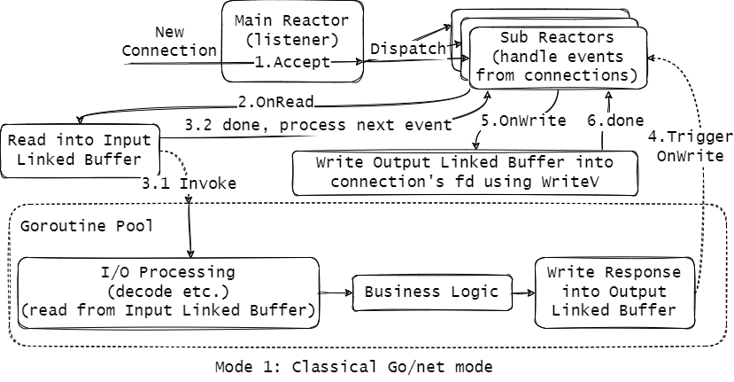
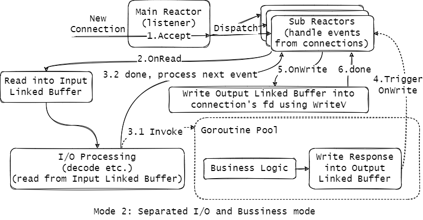
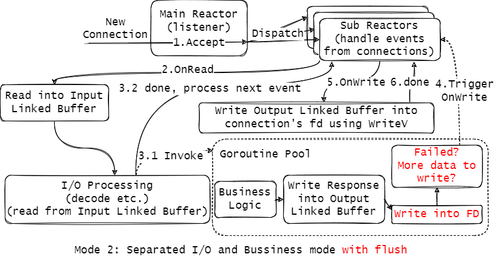

# 简介

[](https://pkg.go.dev/github.com/trpc.group/tnet)
[](https://goreportcard.com/report/github.com/trpc.group/trpc-go/tnet)
[](https://github.com/trpc.group/tnet/blob/main/LICENSE)
[](https://github.com/trpc.group/tnet/releases)
[](http://test.trpc.group.woa.com/docs/)
[](https://github.com/trpc.group/tnet/actions/workflows/prc.yaml)
[](https://app.codecov.io/gh/trpc.group/tnet/tree/main)

[English](./README.md)

__tnet__ 是一个提供了多种模式以满足不同业务需求的网络库，它解决了以下业务诉求：

* 支持更多的连接数（百万级别）
* 更高的性能（QPS, 时延）
* 更少的内存（相较于 go/net 只需要 ~10% 的内存）
* 易用性（和 go/net 提供的接口保持一致）

已支持的特性：

* TCP, UDP
* IPv4, IPv6
* 提供阻塞和非阻塞读写 API
* 提供零拷贝读写 API
* 提供批量收发包能力 (readv/writev)
* 支持服务端和客户端开发
* 支持 Linux / Mac OS
* 支持 TLS
* 支持 WebSocket

## 用法说明

对于 `tnet` 网络库本身而言，它提供了两类使用方法：

1. 用户 handler 不在 poller 协程中
2. 用户 handler 在 poller 协程中

如下图所示：


`tnet` 默认提供第一类使用方法，第二类使用方法通过 `tnet.WithNonBlocking(true)` 来打开（见 `examples` 文件夹下的具体例子）

在这两类使用方法基础之上，用户在 handler 中通过选择是否使用业务协程池来进一步分化出更细粒度的模式，具体而言，

* 在第一类中不使用业务协程池对应“类 Go/net 模式”，特点：

协程数 = poller 个数 + 活跃连接数，适用于网络 IO 与 CPU 处理均衡的业务场景，缺点是不支持连接多路复用，同一个连接上无法支持业务的并发处理（IO 处理部分无法并发）




对于第二类 handler 在 poller 协程中的场景，handler 函数通常可以划分为以下两种模式：

1. IO 处理和业务分离
2. IO 处理和业务合并

* 在第二类中使用业务协程池对应“IO 处理与业务分离模式”，特点：

协程数 = poller 个数 + 数据包的并发处理数，适用于 CPU 密集型场景



* 在第二类中不使用业务协程池对应“IO 处理与业务合并模式”，特点：

协程数 = poller 个数，但是场景苛刻，经典的使用场景为网关场景，这种场景下大部分逻辑只是在做请求的转发，每个请求处理的时间耗时很低，不会出现阻塞，适用于此模式


## 支持的 TCP Option 

* `tnet.WithTCPKeepAlive` 设置了连接探活的时间间隔，默认值为 15s，设置为 0 时可以关闭连接探活

```golang
// WithTCPKeepAlive sets the tcp keep alive interval.
func WithTCPKeepAlive(keepAlive time.Duration) Option {
	return Option{func(op *options) {
		op.tcpKeepAlive = keepAlive
	}}
}
```

* `tnet.WithTCPIdleTimeout` 设置了连接的空闲超时时间，空闲时间超过给定值时会自动断开连接

```golang
// WithTCPIdleTimeout sets the idle timeout to close tcp connection.
func WithTCPIdleTimeout(idleTimeout time.Duration) Option {
	return Option{func(op *options) {
		op.tcpIdleTimeout = idleTimeout
	}}
}
```

* `tnet.WithOnTCPOpened` 可以设置 TCP 连接刚建立时需要进行的操作

```golang
// WithOnTCPOpened registers the OnTCPOpened method that is fired when connection is established.
func WithOnTCPOpened(onTCPOpened OnTCPOpened) Option {
	return Option{func(op *options) {
		op.onTCPOpened = onTCPOpened
	}}
}
```

* `tnet.WithOnTCPClosed` 可以设置 TCP 连接断开时需要进行的操作

```golang
// WithOnTCPClosed registers the OnTCPClosed method that is fired when tcp connection is closed.
func WithOnTCPClosed(onTCPClosed OnTCPClosed) Option {
	return Option{func(op *options) {
		op.onTCPClosed = onTCPClosed
	}}
}
```

* `tnet.WithTCPFlushWrite(true)` 使用户可以直接在当前业务协程中及时完成发包：

```golang
// WithTCPFlushWrite sets whether use flush write for TCP
// connection or not. Default is notify.
func WithTCPFlushWrite(flush bool) Option {
	return Option{func(op *options) {
		op.flushWrite = flush
	}}
}
```

以分离模式为例，启用了 TCPFlushWrite 后的流程图如下所示：



## 支持的 UDP Option 

* `tnet.WithOnUDPClosed` 可以设置 UDP 关闭时所需要进行的操作

```golang
// WithOnUDPClosed registers the OnUDPClosed method that is fired when udp connection is closed.
func WithOnUDPClosed(onUDPClosed OnUDPClosed) Option {
	return Option{func(op *options) {
		op.onUDPClosed = onUDPClosed
	}}
}
```

* `tnet.WithMaxUDPPacketSize` 设置了 UDP 包的最大长度

```golang
// WithMaxUDPPacketSize sets maximal UDP packet size when receiving UDP packets.
func WithMaxUDPPacketSize(size int) Option {
	return Option{func(op *options) {
		op.maxUDPPacketSize = size
	}}
}
```

## 支持的 common Option 

* `tnet.WithNonBlocking` 可以设置阻塞/非阻塞模式，也是控制 IO 处理是否在 Poller 协程内的一个选项，默认为阻塞模式，IO 处理不在 Poller 协程内

```golang
// WithNonBlocking set conn/packconn to nonblocking mode
func WithNonBlocking(nonblock bool) Option {
	return Option{func(op *options) {
		op.nonblocking = nonblock
	}}
}
```

## API 用法解释

`tnet.Conn` 接口在 `net.Conn` 基础之上进行了扩展

* 包含的四个零拷贝 API 如下：

```golang
// Peek returns the next n bytes without advancing the reader. It waits until it has
// read at least n bytes or error occurs such as connection closed or read timeout.
// The bytes stop being valid at the next ReadN or Release call.
// Zero-Copy API.
Peek(n int) ([]byte, error)

// Next returns the next n bytes with advancing the reader, It waits until it has
// read at least n bytes or error occurs such as connection closed or read timeout.
// The bytes stop being valid at the next ReadN or Release call.
// Zero-Copy API.
Next(n int) ([]byte, error)

// Skip the next n bytes and advance the reader. It waits until the underlayer has at
// least n bytes or error occurs such as connection closed or read timeout.
// Zero-Copy API.
Skip(n int) error

// Release releases underlayer buffer when using Peek() and Skip() Zero-Copy APIs.
Release()
```

> 1. Peek：读取给定数量的字节，但是不移动下层 Linked Buffer 的 读指针，返回的 byte slice 直接引用自 Linked Buffer，此时要求这部分数据在使用完之前不能被释放掉
> 2. Skip：移动下层 Linked Buffer 的 读指针，使其跳过给定数量的字节，通常与 Peek 合用
> 3. Next：等价于先调用 Peek，然后调用 Skip，返回的 byte slice 会在 Release 的调用后失效
> 4. Release：释放掉已经读过的部分，通常在使用完 byte slice 后使用，在调用安全 API Read/ReadN 时会自动调用 Release 来释放已读空间


* `tnet.Conn` 提供了 `Writev`，用来依次写出多个数据块，比如包头和包体，不需要手动进行数据包的拼接，使用例子见 `examples/tcp/classical/main.go`
```golang
// Writev provides multiple data slice write in order.
Writev(p ...[]byte) (int, error)
```

* `tnet.Conn` 还提供了感知连接状态的方法：`IsActive`
```golang
// IsActive checks whether the connection is active or not.
IsActive() bool
```

* `tnet.Conn` 提供了 `SetMetaData/GetMetadata` 用于存储/读取用户在连接上的私有数据：

```golang
// SetMetaData sets meta data. Through this method, users can bind some custom data to a connection.
SetMetaData(m interface{})
// GetMetaData gets meta data.
GetMetaData() interface{}
```

## 使用案例

* tRPC-Go

tRPC-Go 已经集成 tnet 

## 实现细节

* [整体结构](./docs/overview_cn.md)
* [协程模型](./docs/models_cn.md)
* [缓冲区设计](./docs/buffer_cn.md)
